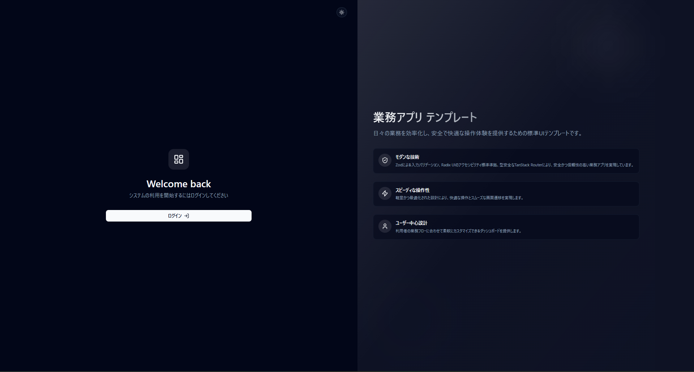

# Business Application SPA Template 2025 (React)

業務アプリケーションの開発を効率化するための **React + Vite ベース SPA テンプレート** です。  
UI には [shadcn/ui](https://ui.shadcn.com/) と [Radix UI](https://www.radix-ui.com/) を活用し、  
ルーティングやテーブル管理など、業務アプリでよく利用される機能を組み込みやすい構成にしています。

---

## 🚀 Demo



このアプリはVercelでホストされています。[こちら](https://business-app-spa-template-2025-reac.vercel.app/)をクリックしてアクセスしてください。

---

## ✨ 特長

- **最新技術構成**  
  React 19, Vite 7, TypeScript 5.8, TailwindCSS 4 を採用  

- **UI/UX**  
  - shadcn/ui, Radix UI によるアクセシブルな UI コンポーネント  
  - lucide-react のアイコンセット  

- **ルーティング**  
  - [TanStack Router](https://tanstack.com/router) による型安全なルーティング  

- **データ表示**  
  - [TanStack Table](https://tanstack.com/table) による柔軟なテーブル管理  

- **開発効率**  
  - Biome による統一された Lint & Format  
  - Volta による Node.js バージョン固定  
  - pnpm による高速パッケージ管理  

---

## 📦 セットアップ

```bash
# 依存関係をインストール
pnpm install

# 開発サーバー起動
pnpm dev

# 本番ビルド
pnpm build

# Lint & Format (Biome)
pnpm lint
